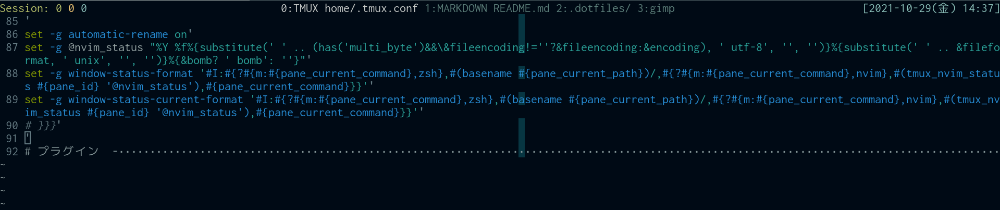

# nvim-status-bash

Portable utilities to get information from nvim.

## Example
Fetch active file info and show in tmux window title.



## Installation
### By hands
Copy scripts from bin to your PATH directory.

### With [dein](https://github.com/Shougo/dein.vim)
```
call dein#add('octaltree/nvim-status-bash')
```

you can get the bin path from `g:nvim_status#bin_dir`

### With [tpm](https://github.com/tmux-plugins/tpm)
```
# List of plugins
set -g @plugin 'octaltree/nvim-status-bash'

# Other examples:
# set -g @plugin 'github_username/plugin_name'
# set -g @plugin 'github_username/plugin_name#branch'
# set -g @plugin 'git@github.com:user/plugin'
# set -g @plugin 'git@bitbucket.com:user/plugin'

# Initialize TMUX plugin manager (keep this line at the very bottom of tmux.conf)
run '~/.tmux/plugins/tpm/tpm'
```

Now you can get the bin path from `tmux show -g @nvim_status_bin`.

## Alternative
- mhinz/neovim-remote
